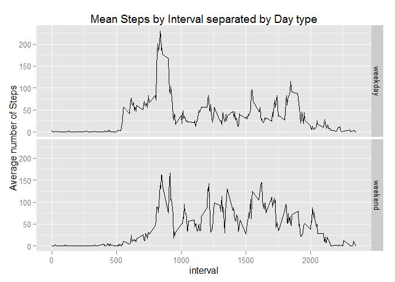

# Reproducible Research: Peer Assessment 1


## Loading and preprocessing the data

```r
activity <- read.csv("activity.csv")
activity_df <- subset(activity, !is.na(steps), select = steps:interval)
```

## What is mean total number of steps taken per day?

```r
total_steps <- aggregate(steps ~ date, activity_df, FUN = "sum")

hist(total_steps$steps, main="Histogram of Total  Steps per Day", xlab = "Steps per day", col = "steelblue", ylim = c(0, 25)) 
```

 

```r
mean <- mean(total_steps$steps)
median <- median(total_steps$steps)
```

The **mean** steps per day: 10766.19  
The **median** of steps per day: 10765

## What is the average daily activity pattern?

```r
mean_steps <- aggregate(steps ~ interval, activity_df, FUN = "mean")
plot(mean_steps$interval, mean_steps$steps, type="l", main="Mean Steps per Day by Interval", xlab = "Interval", ylab = "Mean steps", col="darkgreen")
```

 

```r
max_interval <- mean_steps[which.max(mean_steps$steps), 1]
```
The 5-minute interval that contains the maximum of steps, on average across all days: **835**

## Inputing missing values

1. Number of missing values

```r
num_na <- sum(is.na(activity$steps))
```
The number of missing values: **2304**

2. Strategy for filling in all of the missing values in the dataset: Using interval mean of each missing value

```r
index <- which(is.na(activity$steps))

# Create a vector of means
mean_vec <- rep(mean_steps[, 2], times=8)
```

3. Create a new dataset that is equal to the original dataset but with the missing data filled in

```r
activity[index, "steps"] <- mean_vec
head(activity)
```

```
##       steps       date interval
## 1 1.7169811 2012-10-01        0
## 2 0.3396226 2012-10-01        5
## 3 0.1320755 2012-10-01       10
## 4 0.1509434 2012-10-01       15
## 5 0.0754717 2012-10-01       20
## 6 2.0943396 2012-10-01       25
```

4. Histogram of the total number of steps taken each day and Calculate and report the mean and median total number of steps taken per day

```r
ntotal_steps <- aggregate(steps ~ date, activity, FUN = "sum")

hist(ntotal_steps$steps, main="Histogram of Total  Steps per Day", xlab = "Steps per day", col = "steelblue", ylim = c(0, 25)) 
```

 

```r
mean <- mean(ntotal_steps$steps)
median <- median(ntotal_steps$steps)
```

The **mean** steps per day: 10766.19  
The **median** of steps per day: 10766.19

The effect of adding missing values had no effect to the new average, as the strategy for missing values was to use the original mean to replace the NA values.

## Are there differences in activity patterns between weekdays and weekends?

```r
library(lubridate)
library(ggplot2)
library(dplyr)
```

```
## 
## Attaching package: 'dplyr'
## 
## The following objects are masked from 'package:lubridate':
## 
##     intersect, setdiff, union
## 
## The following object is masked from 'package:stats':
## 
##     filter
## 
## The following objects are masked from 'package:base':
## 
##     intersect, setdiff, setequal, union
```


```r
activity$date <- ymd(activity$date)

activity <- mutate(activity, day = wday(date, label = TRUE),  daytype = ifelse(day == "Sat" | day == "Sun", "weekend", "weekday"))
mean_steps <- aggregate(steps ~ interval + daytype, activity, FUN = "mean")

qplot(x = interval, y = steps, data = mean_steps, geom = c("line"), facets = daytype~., ylab = "Average number of Steps", main="Mean Steps by Interval separated by Day type")
```

 
